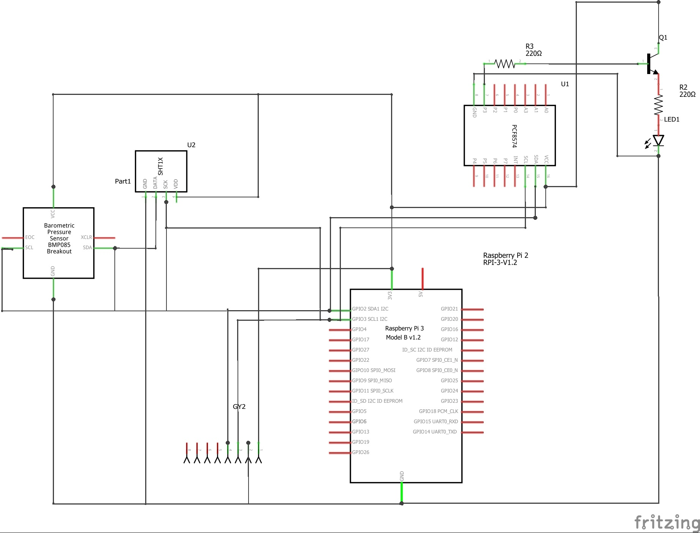

# DataCollector.NET

  1. Information 
     *Code Quality*: 
  2. Purpose
  3. Concept

## PC

  * Client
  * Server
  * Communication

## Device

  Project is designed for Raspberry Pi 2/3 board and use Windows 10 Iot Core.

  * Windows IoT

    **Windows 10 IoT is still under development and I don't require it to use in production.** 
    *DataCollector.Device.Task* works as a task in Windows environment. 
    It needs to be installed via Windows IoT Hub (http://RaspberryIp:8080/). But before you do that, you should make a package from Visual     Studio project selecting *DataCollector.Device.Task* project with PPM and select *Store -> Create app package*. You will get a package     as folder which you can install directly in device. 
    You can also debug code in Visual Studio by selecting your connected device as a Remote Device. 
    For more info please visit: https://developer.microsoft.com/en-US/windows/iot/GetStarted#

  * Device
  
    For development I've been using Raspberry Pi 2 board and prototype board with devices connected to I2C1. 
    *I2C is a transfer protocol where each of connected device has an unique address from range 0 to 127.* 
    Each of device is called module (from code class name convention) and they are managed by *BusDevicesController*. 
     
    Parts:
      * [BMP085](https://www.sparkfun.com/datasheets/Components/General/BST-BMP085-DS000-05.pdf) - Air pressure and temperature meter with a lot of types of measure.
      * [MPU_6050](https://www.invensense.com/wp-content/uploads/2015/02/MPU-6000-Datasheet1.pdf) - Accelerometer and gyroscope meter.
      * [PCF8574](http://www.ti.com/lit/ds/symlink/pcf8574.pdf) - I2C GPIO Expander. It is used to control LED via transistor NPN.
      * [Sensirion SHT21](https://anel-elektronik.de/SITE/produkte/sensor_1/Datasheet%20SHT21.pdf) - Humidity and temperature meter.
  
  * Schematics
  
    * Prototype board design
    
    * Electronic diagram
    
    
  * Code Architecture
 
    Device task contains 2 projects:
    
    * *DataCollector.Device* - provide a controllers to bring and keep data from bus devices in memory and to share this data via REST         protocol.
    
      Controllers:
      * *BusDevicesController* - I2C devices manager. It has taking responsible for download measure data from each device to create an         object of type *Measures*.
      * *JsonMeasuresDataController* - Measure data container - stores data into memory and convert it to json to send via REST client.
      * *NetworkAccessController* - Create a web server.
      * *WebResponseController* - Provide an API to communicate with external system to control a LED State and for share a measures             data.
      * *ILedController* - Extra controller which is an alias for *PCF8574Module* - it controls a LED state connected to *PCF8574*.
      
      Modules (all of them deriving from *I2CBusDevice* to provide basic functionality):
      * *BMP085* - Download na air pressure data from device.
      * *MPU_6050* - Download an accelerometer and gyroscope data from device.
      * *PCF8574* - Download and control a LED State data from device.
      * *Sensirion SHT21* - Download a temperature and humidity data from device.
    
    * *DataCollector.Device.Task* - startup point for application
    
      This project use IoC Container called [Autofac](https://github.com/autofac/Autofac) to provide a dependencies for controllers and       control a task lifetime cycle. 
      I wanted to register objects that are divided by purposes with real-time constructor resolving to prevent from using **new** keyword.
      
   * API
   
      To bring the access for the measures I've created a WebController to share data with external clients.
      Requests:
      * */getLedState* - Returns a state of the LED
      * */ledState?p={val}* - Set a LED state and returns a state after
      * */measurements* - Returns an object that contains data from the connected sensors
   
  
